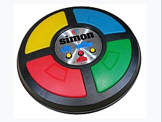
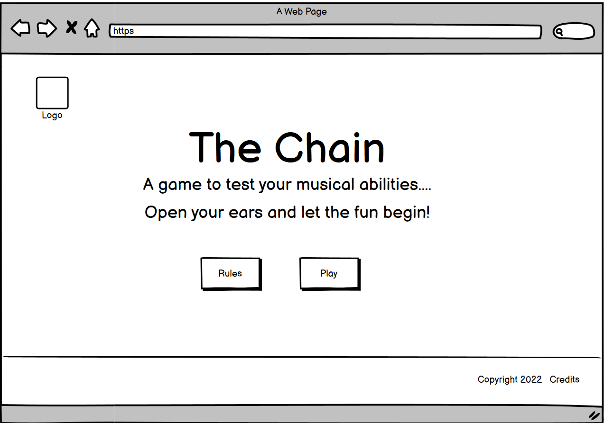
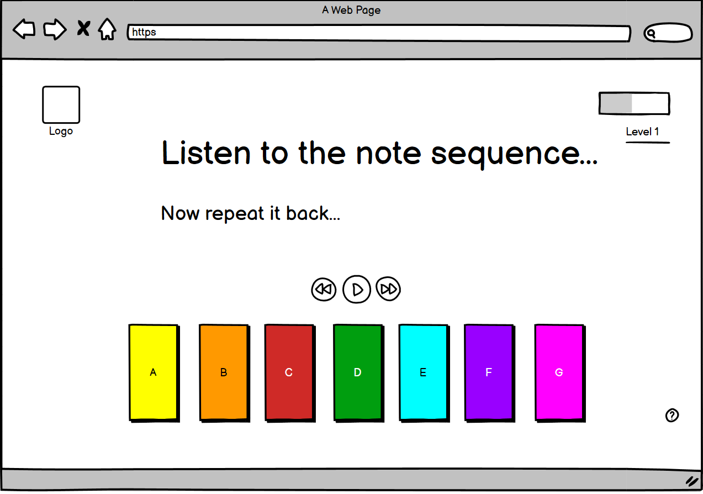

#  **The Chain**  
## *Hone your listening skills!!*

Based on the original 'Simon' electronic short-term memory game launched in 1978, we have created an educational computer-based modern version whereby the player listens to a sequence of notes, and has to repeat them back. Through this playback, the user is training their ear, learning a basic piano octave, and training their short-term memory. 

Welcome to <a href="https://craigthomasson.github.io/team-5-music-game-/" target="_blank" rel="noopener">The Chain</a>

## User Experience

### Wireframes

We created two wireframes for this game. The homepage and the game page, both created in desktop view, but we hope to make the game responsive and also able to be played on a mobile as well. 

### Colour Scheme

The colour scheme that we agreed upon for this project stemmed from the following colour palette:

## Features

### Home Page

The home page consists of  Navigation bar, with a logo and menu options for Home and to see the Rules. There is also a rules button in the centre of the homepage which opens up a modal window containing the rules. A second page is displayed to the user below the main game Title, which starts the game. There is a footer at the bottom of the page with links to the team's repository and individual GitHub info. 

### Game Page

Once the player clicks the start button on the homepage they are taken to the game page. The styling remains consitent with the home page for better user experience, and the Navigation bar is still visible if the player wants to return Home or review the rules. A set of seven clickable buttons are visible on the screen which represent a full octave of notes on a piano scale. 

## How to play

The game logic was designed with the original 'Simon' logic in mind. This is the logic workflow that was agreed on:

Once you click the 'play' button you will hear a note played, and the corresponding note button will be highlighted. 

The user has to click the same note button to pass the level. 

Once they have passed the intial levels of learning each of the 7 notes, the computer will the begin to randomly generate longer and longer sequences of notes, until they are no longer capable of remembering and repeating back the full sequence. Once they repeat an incorrect sequence of notes back, game is over. 

### Deployed link

[Click here to play!](https://craigthomasson.github.io/team-5-music-game-/)

## Credits

### Media

* The background image used for this game was sourced from [Pixabay](https://pixabay.com/images/search/music%20background/?pagi=7)

* The audio files for the piano note were sourced from [Pixabay](https://pixabay.com/sound-effects/search/octave/)

* The [Bootstrap 4 Library](https://getbootstrap.com/docs/4.6/getting-started/introduction/) was used to help create the HTML and CSS

* The [jQuery Library](https://jquery.com/) was used to help with the Javascript

### Team Members

* [Craig Thomasson](https://www.linkedin.com/in/craig-thomasson-webdev/)
* [Karolina Cisek](https://www.linkedin.com/in/k-c-n/)
* [Eric Hagman](https://www.linkedin.com/in/erikhgm/)
* [Kelly Hutchison](https://www.linkedin.com/in/kellyhutchison/)

