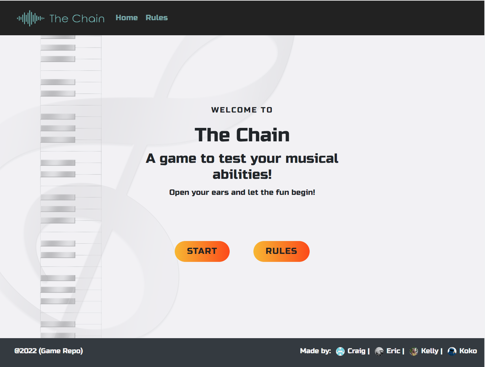

#  **The Chain**  
## *Hone your listening skills!!*

Based on the original 'Simon' electronic short-term memory game launched in 1978, we have created an educational computer-based modern version whereby the player listens to a sequence of notes, and has to repeat them back. Through this playback, the user is training their ear, learning a basic piano octave, and training their short-term memory. 

Welcome to <a href="https://craigthomasson.github.io/team-5-music-game-/" target="_blank" rel="noopener">The Chain</a>

## User Experience

### Wireframes

We created two wireframes for this game. The homepage and the game page, both created in desktop view.

However, this game is fully responsive and can be played both on desktop and mobile devices. On smaller devices the Navigation Bar changes into a dropdown menu.

### Colour Scheme

The colour scheme that we agreed upon for this project stemmed from the following colour palette:

## Features

### Home Page

The home page consists of  Navigation bar, with a logo and menu options for Home and to see the Rules. There is also a rules button in the centre of the homepage which opens up a modal window containing the rules. 

A 'start' button is displayed to the user below the main game Title, which starts the game. There is a footer at the bottom of the page with links to the team's repository and individual GitHub info. 

### Game Page

Once the player clicks the 'start' button on the homepage they are taken to the game page. The styling remains consistent with the home page for better user experience, and the Navigation bar is still visible if the player wants to return Home or review the rules. A set of seven clickable buttons are visible on the screen which represent C to B on a piano scale. 

## How to play

The game logic was designed with the original 'Simon' logic in mind. This is the logic workflow that was agreed on and we worked towards when coding the Javascript:

However, the original Simon game repeats the same sequence every round but adds a new note each time. In this game, a new randomly generated sequence is played in each round to make the game more interesting. 

Once you click the 'play' button you will hear a note played, and the corresponding note button will be highlighted. 

The user has to click the same note button to pass the level. 

As the user progresses through each level the computer will randomly generate longer and longer sequences of notes, until the user repeats back the sequence incorrectly. Once this occurs, the game is over, the user loses their points accumulated and they go back to level 1 with a 1 note sequence. 

There is a 'hard/easy' toggle button next to the 'start button where you can alternate between two levels of difficulty when playing the game. If you play the game in 'hard' mode the music keys will not be highlighted when the computer plays the sound sequence, so you have to remember the keys only by sound and not by look or colour. This encourages the player to listen and remember the sounds more than visually remember the sequence. 

### Deployed link

[Click here to play!](https://craigthomasson.github.io/team-5-music-game-/)

## Credits

### Media

* The background image used for this game was sourced from [Pixabay](https://pixabay.com/images/search/music%20background/?pagi=7)

* The audio files for the piano note were sourced from [Pixabay](https://pixabay.com/sound-effects/search/octave/)

* The [Bootstrap 4 Library](https://getbootstrap.com/docs/4.6/getting-started/introduction/) was used to help create the HTML and CSS

* The [jQuery Library](https://jquery.com/) was used to help with the Javascript

### Team Members

* [Craig Thomasson](https://www.linkedin.com/in/craig-thomasson-webdev/)
* [Karolina Cisek](https://www.linkedin.com/in/k-c-n/)
* [Eric Hagman](https://www.linkedin.com/in/erikhgm/)
* [Kelly Hutchison](https://www.linkedin.com/in/kellyhutchison/)

